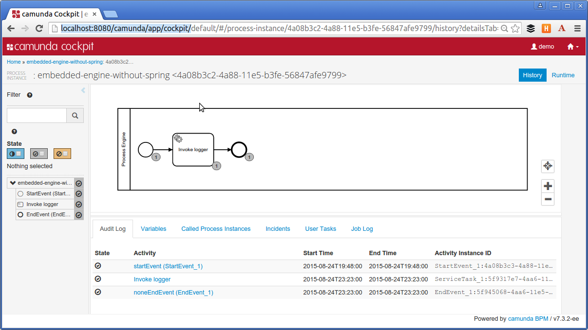

# Embedded Process Engine without Spring
A Process Application containing an embedded process engine that is configured in the processes.xml file and therefore does not require the Spring Framework as a dependency.


This project has been generated by the Maven archetype
[camunda-archetype-ejb-war-7.3.1-SNAPSHOT](http://docs.camunda.org/latest/guides/user-guide/#process-applications-maven-project-templates-archetypes).

## Show me the important parts!

### processes.xml
```xml
<?xml version="1.0" encoding="UTF-8"?>
<process-application
  xmlns="http://www.camunda.org/schema/1.0/ProcessApplication"
  xmlns:xsi="http://www.w3.org/2001/XMLSchema-instance">

  <process-engine name="default">
    <configuration>org.camunda.bpm.engine.impl.cfg.StandaloneProcessEngineConfiguration</configuration>
    <datasource>java:jboss/datasources/ProcessEngine</datasource>
    <properties>
        <property name="history">full</property>
        <property name="databaseSchemaUpdate">true</property>
        <property name="authorizationEnabled">true</property>
        <property name="jobExecutorDeploymentAware">true</property>
    </properties>
    <plugins>

      <!-- plugin enabling Process Application event listener support -->
      <plugin>
        <class>org.camunda.bpm.application.impl.event.ProcessApplicationEventListenerPlugin</class>
      </plugin>
      
      <!-- plugin enabling integration of camunda Spin -->
      <plugin>
        <class>org.camunda.spin.plugin.impl.SpinProcessEnginePlugin</class>
      </plugin>

      <!-- plugin enabling connect support -->
      <plugin>
        <class>org.camunda.connect.plugin.impl.ConnectProcessEnginePlugin</class>
      </plugin>
      
   </plugins>
  </process-engine>

  <process-archive>
    <process-engine>default</process-engine>
    <properties>
      <property name="isDeleteUponUndeploy">false</property>
      <property name="isScanForProcessDefinitions">true</property>
    </properties>
  </process-archive>

</process-application>

```

## How does it work?

### pom.xml
```xml
    <dependency>
      <!-- process engine in compile scope to include it in the war file -->
      <groupId>org.camunda.bpm</groupId>
      <artifactId>camunda-engine</artifactId>
      <scope>compile</scope>
    </dependency>

    <!-- Spin dataformat support, in compile scope to include it in the war file -->
    <dependency>
      <groupId>org.camunda.spin</groupId>
      <artifactId>camunda-spin-dataformat-all</artifactId>
      <scope>compile</scope>
    </dependency>
    <dependency>
      <groupId>org.camunda.bpm</groupId>
      <artifactId>camunda-engine-plugin-spin</artifactId>
      <scope>compile</scope>
    </dependency>

    <!-- Connectors, in compile scope to include it in the war file -->
    <dependency>
      <groupId>org.camunda.connect</groupId>
      <artifactId>camunda-connect-connectors-all</artifactId>
      <scope>compile</scope>
    </dependency>
    <dependency>
      <groupId>org.camunda.bpm</groupId>
      <artifactId>camunda-engine-plugin-connect</artifactId>
      <scope>compile</scope>
    </dependency>

      <dependency>
        <groupId>com.fasterxml.uuid</groupId>
        <artifactId>java-uuid-generator</artifactId>
      </dependency>
```

See also:

 * [Deployment Descriptor Reference: processes.xml](http://docs.camunda.org/latest/api-references/deployment-descriptors/#descriptors-processesxml)
 * [processes.xml section of the User Guide](http://docs.camunda.org/latest/guides/user-guide/#process-applications-the-processesxml-deployment-descriptor)
 * [Configuring process engines in the processes.xml file](http://docs.camunda.org/latest/guides/user-guide/#process-applications-the-processesxml-deployment-descriptor-configuring-process-engines-in-the-processesxml-file)
 * [Deployment Descriptor Reference: Process Engine Configuration](http://docs.camunda.org/latest/api-references/deployment-descriptors/#tags-process-engine-configuration)

## Camunda Cockpit Integration

To use a Cockpit with the embedded engine, download the
[Standalone Web Application Distribution](http://docs.camunda.org/7.3/guides/user-guide/#introduction-download-standalone-web-application-distribution)
and change the file `WEB_INF/applicationContext.xml` file inside the WAR file to point to the same datasource than the process engine:

```xml
  <bean id="dataSource" class="org.springframework.jndi.JndiObjectFactoryBean">
    <property name="jndiName" value="java:jboss/datasources/ProcessEngine"/>
  </bean>
```

You should also disable the `databaseSchemaUpdate` and you may have to set the history level to match that of your embedded engine:

```xml
  <bean id="processEngineConfiguration" class="org.camunda.bpm.engine.spring.SpringProcessEngineConfiguration">
    ...
    <property name="databaseSchemaUpdate" value="false" />
    <property name="history" value="full" />
    ...
```

Here is an example file: [applicationContext.xml](applicationContext.xml)

After deploying the application, visit [http://localhost:8080/camunda/](http://localhost:8080/camunda/).



## Camunda Worbench Integration

The example also embedds the [Camunda BPM Workbench](https://github.com/camunda/camunda-bpm-workbench). After deploying the web application visit [http://localhost:8090/#/debug](http://localhost:8090/#/debug).


If you don't want the uses this, remove the Maven dependency from the `pom.xml` and the plugin from the process engine configuration in the `pocesses.xml`.

## How to use it?
There is no web interface to access the application.
To get started refer to the `InMemoryH2Test`.

There is also an `ArquillianTest`, which by default connects to a
Camunda BPM platform running locally on a JBoss AS 7.
You can download a Camunda BPM distribution for JBoss from the
[Camunda BPM download page](http://camunda.org/download/).

You can also use `ant` to build and deploy the example to an application server.
For that to work you need to copy the file `build.properties.example` to `build.properties`
and configure the path to your application server inside it.
Alternatively, you can also copy it to `${user.home}/.camunda/build.properties`
to have a central configuration that works with all projects generated by the
[Camunda BPM Maven Archetypes](http://docs.camunda.org/latest/guides/user-guide/#process-applications-maven-project-templates-archetypes).

Once you deployed the application you can run it using
[Camunda Tasklist](http://docs.camunda.org/latest/guides/user-guide/#tasklist)
and inspect it using
[Camunda Cockpit](http://docs.camunda.org/latest/guides/user-guide/#cockpit).

## Environment Restrictions
Built and tested against Camunda BPM version 7.3.0 on a JBoss AS7 with [this configuration](standalone.xml).

## Known Limitations
Currently, it is not possible to configure the parameters of the Job Executor through the processes.xml file.
As a workaround, one could put a bpm-platform.xml into the application and do the bootstrap similar to how it is done in the class [TomcatBpmPlatformBootstrap](https://github.com/falko/camunda-bpm-platform/blob/master/engine/src/main/java/org/camunda/bpm/container/impl/tomcat/TomcatBpmPlatformBootstrap.java).
This bootstrapping approach would also allow for loading the bpm-platform.xml from a different location and thus have a central engine configuration.

Using the `DefaultEjbProcessApplication` result in: `java.sql.SQLException: You cannot commit during a managed transaction!`

## Improvements Backlog
One could add JBoss module dependencies to get the engine and plugin jar files from the container and avoid rebuilding the applications for an engine upgrade.

## License
[Apache License, Version 2.0](http://www.apache.org/licenses/LICENSE-2.0).
